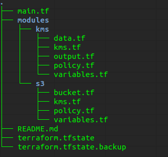

# terraform-private-bucket-with-key-kms

This terraform project creates an encrypted private bucket S3 using KMS. For this, we use the following features:

- S3
- KMS

## Directory structure




## Explaining the modules

### File main.tf

File found at project root and responsible for calling modules.

This file have a two configs: `provider aws` and `module secure-s3`

- Provider configuration we define our provider, alias, profile and region used;
- In the secure-s3 module, this is where we call the S3 module by passing the parameters required for private bucket and KMS description.


### Module S3

- bucket.tf

In this file we create the bucket in s3 and create a feature to link the created policy. We have also customized some configurations of this bucket so that it is versioned, transitions between storage types, and use KMS encryption.

- kms.tf

In this file we are calling the KMS module, to call this module we have to pass some fields that are defined as variables in the KMS module.

- policy.tf

In this file we are defining the policy that our bucket will use, this policy will deny any upload of files that is not being encrypted using the KMS key, at the end of the file i leave the command to upload.

- variables.tf

Definition of all variables being used in bucket creation.

### Module KMS

- data.tf

Use this data source to get the access to the effective Account ID, User ID, and ARN.

- kms.tf

File where we create our kms resource, in this file we are also creating an alias for kms.

- output.tf

We set the output values of the kms module to be used by the s3 module.

- policy.tf

In this file, we are defining the policy that our KMS resource will use, this policy allows only own resources to use the kms key created.

- variables.tf

Definition of all variables being used in KMS creation.

### Terraform initial settings


To use terraform, we first have to configure the `/home/user/.aws/credentials` file. After these settings just run the command below to download terraform dependencies:

> terraform init

### Validating changes

To validate the changes that will be applied, simply execute the command below:

> terraform plan

### Applying the changes

After validation with the `plan` command it is time to create all the resources of this procect, to do so, execute the command below:

> terraform apply


### Removing settings

To remove all instalation performed in the AWS environment, simply run the command:

> terraform destroy

### command upload object in S3

```
aws s3api put-object --bucket bucket-name --key file-to-upload-example.txt --server-side-encryption aws:kms --ssekms-key-id complete-arn-kms --body /home/dir/file-to-upload-example.txt
```

### References

Learn about [Terraform](https://learn.hashicorp.com/terraform)

See more about [S3](https://aws.amazon.com/pt/s3/)

See more about [KMS](https://aws.amazon.com/kms/)